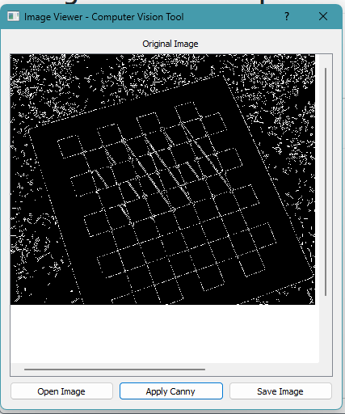

---

---

# Image Viewer - Computer Vision Tool

  
*Example: Your GUI screenshot or sample result image*

---

## Table of Contents
1. [Project Overview](#project-overview)  
2. [Features](#features)  
3. [Installation](#installation)  
4. [Usage](#usage)  
5. [How It Works](#how-it-works)  
6. [Example Results](#example-results)  
7. [Folder Structure](#folder-structure)  
8. [Dependencies](#dependencies)  
9. [Future Improvements](#future-improvements)  
10. [License](#license)  

---

## Project Overview

This project is a **PyQt5-based Image Viewer** designed for **computer vision experiments**. Users can open images, apply edge detection (Canny), and save the processed results. The application uses **OpenCV** for image processing and **QGraphicsView** to display images interactively.

---

## Features

- Open images of formats: PNG, JPG, JPEG, BMP, GIF  
- Apply **Canny edge detection** to images  
- Save processed images to a specified path  
- Clean, modern GUI designed with **Qt Designer**  
- Responsive image display inside `QGraphicsView`  
- Button hover effects and styling using **QSS** (Qt Style Sheets)

---

## Installation

1. Clone the repository:  
```bash
git clone https://github.com/yourusername/ImageViewerCV.git
cd ImageViewerCV
